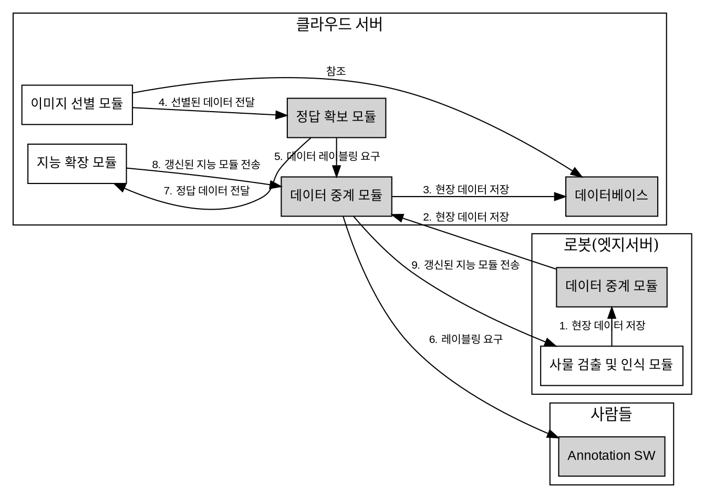

```dot
digraph G {
    rankdir=LR
    compound=true;

    node [shape=rectangle, fontsize=12, fontname="Arial"];
    edge [fontsize=10, fontname="Arial"];

    a [label="사물 검출 및 인식 모듈"]
    b [label="데이터 중계 모듈",style="filled"]
    c [label="이미지 선별 모듈"]
    d [label="정답 확보 모듈",style="filled"]
    f [label="Annotation SW",style="filled"]
    e [label="지능 확장 모듈"]
    g [label="데이터 중계 모듈",style="filled"]
    h [label="데이터베이스",style="filled"]

    subgraph cluster_0 {
        label="로봇(엣지서버)";
        a;
        b;
    }
    
    subgraph cluster_1 {
        label="클라우드 서버";
        c;
        d;
        e;
        g;
        h;
    }
    
    subgraph cluster_2 {
        label ="사람들";
        f;
    }

    a -> b [label="1. 현장 데이터 저장", constraint=false]
    b -> g [label="2. 현장 데이터 저장"]
    d -> e [label="7. 정답 데이터 전달", constraint=false]
    e -> g [label="8. 갱신된 지능 모듈 전송"]
    c -> d [label="4. 선별된 데이터 전달"]
    g -> a [label="9. 갱신된 지능 모듈 전송"]
    d -> g [label="5. 데이터 레이블링 요구", constraint=false]
    c -> h [label="참조", constraint=false]
    g -> h [label="3. 현장 데이터 저장"]
    g -> f [label="6. 레이블링 요구"]
}
```